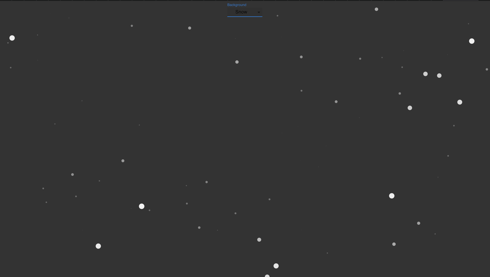

# Customizable Backgrounds from TS Particles

Was messing around with templates from TS Particles and wanted to get familiar with some of the different themes.

Utilized themes from TS Particles are listed below:

- A
  - Absorbers
  - Among Us
- B
  - Background Mask
  - Background Mask Image
  - Basic
  - Big
  - Black Hole
  - Bubble
- C
  <!-- - Cards -->
  - Chars
  <!-- - Click Confetti -->
  - Click Pause
  - Collisions Absorb
  - Collisions Bounce
  - Collisions Destroy
  - Color Animation
  - Connect
  - Curl Noise
- D
  - Data Images
  - Delay
  - Delay Color
  - Delay Opacity
  - Delay Size
  - Delay Stroke Color
  - Destroy
  - Disappearing
  - Div Events
- E
  - Effect Bubble
  - Effect Trail
  - Emitter
  <!-- - Emitter Absorb
  - Emitter Angled
  - Emitter Images
  - Emitter Image Shape -->
  <!-- - Emitter Paths
  - Emitter Shapes
  - Emitter Spawn Color
  - Emitter Text Shape
  - Emitter Text Stroke Shape -->
- F
  <!-- - Fireworks -->
  <!-- - Fireworks 2 -->
  - Font Awesome
  - Forward
- G
  - GIFs
  - Grab Random Color
  - Gradients
  <!-- - Gravity
  - Growing -->
- H
  <!-- - Hexagon Path -->
  - Hollow Knight
  <!-- - Hyperspace -->
- I
  - Image Mask
  - Images
  - Images Directions
  <!-- - Infection -->
<!-- - J
- K
-->
- L
  - Life
  - Light Hover
  - Link Triangles
  - Local Polygon Mask
- M
  - Manual
  - Motion Disable
  - Motion Reduce
  - Mouse Attract
  - Mouse Bounce
  - Mouse Follow
  <!-- - Mouse Particle -->
  - Mouse Particle 2
  - Mouse Trail
  <!-- - Mouse Trail Noise -->
  - Move Angle
  - Move Distance
  - Move Inside
  - Move Outside
  <!-- - Multiple Click Emitters -->
  - Multiple Polygon Masks
- N
  - NASA
  - No Clear
  - Noise Planes
  - Nyan Cat
  - Nyan Cat 2
- O
  - Orbit
- P
  - Parallax
  - Path Polygon Mask
  - Path SVG
  - Path Zig Zag
  - Planes
  - Plasma
  - Poisson
  - Polygon Mask
  - Polygons
  - Pop
<!-- - Q -->
- R
  - Random
  - React Bubbles
  - React Defaults
  - React Multiple Images
  - React Night Sky
  - React Polygon Mask
  - React Simple
  - React Snow
  - Reduce Duplicates
  - Repulse
  - Repulse Back
  - Repulse Circ
  - Repulse Cubic
  - Repulse Expo
  - Repulse Quart
  - Repulse Quint
  - Repulse Sine
  - Responsive
  - Ring
- S
  <!-- - Sea Anemone -->
  - Shadow
  <!-- - Shape Arrow -->
  <!-- - Shape Cog -->
  <!-- - Shape Emoji -->
  - Shape Heart
  - Shape Multiline Text
  - Shape Options
  <!-- - Shape Path -->
  - Shape Rounded Polygon
  - Shape Rounded Rect
  <!-- - Shape Spiral -->
  - Slow
  - Snow
  <!-- - Sounds Audio
  - Sounds Loop
  - Sounds Melodies
  - Sounds Melody Loop -->
  <!-- - Sounds Notes -->
  - Speed Decay
  - Spin
  - Star
  - Stroke Animation
  - Style
  <!-- - SVG Replace -->
- T
  <!-- - Test -->
  - Text Mask
  - Text Mask Multiline
  - Themes
  <!-- - Tilt -->
  <!-- - Trail -->
  - Trail Image
  - Triangles
  - Twinkle
<!-- - U -->
- V
  - Vibrate
  - Virus
<!-- - W -->
  <!-- - Warp -->
  <!-- - Wobble -->
<!-- - X
- Y -->
- Z
  - Z Index

## Project Setup

`yarn` or `yarn install`
then
`yarn start`

## Project View

